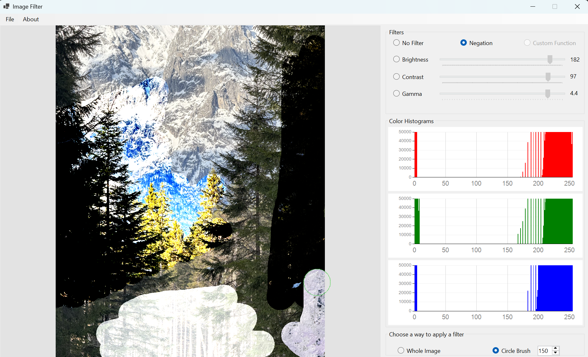
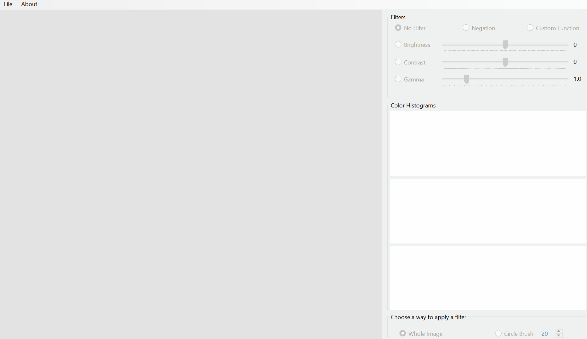
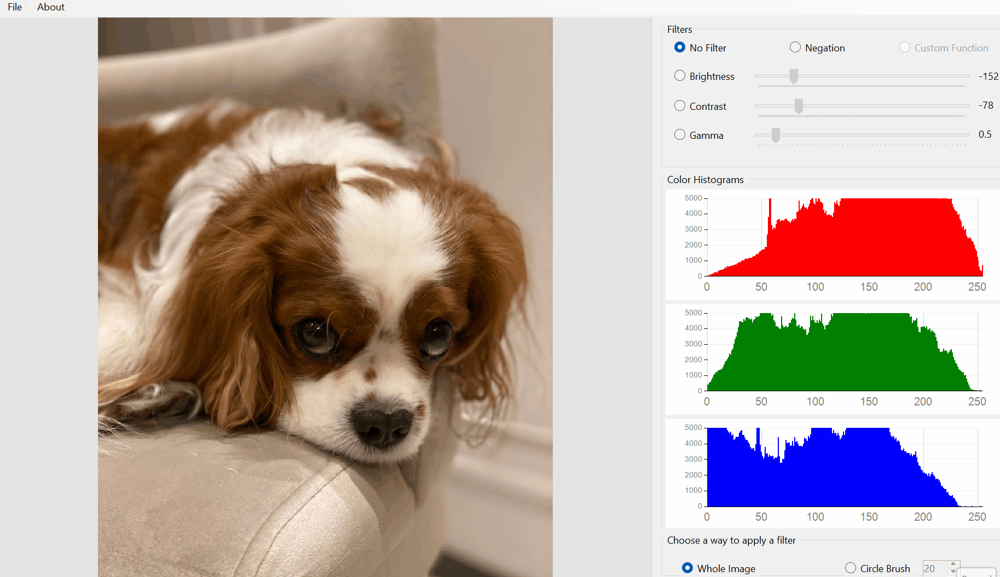
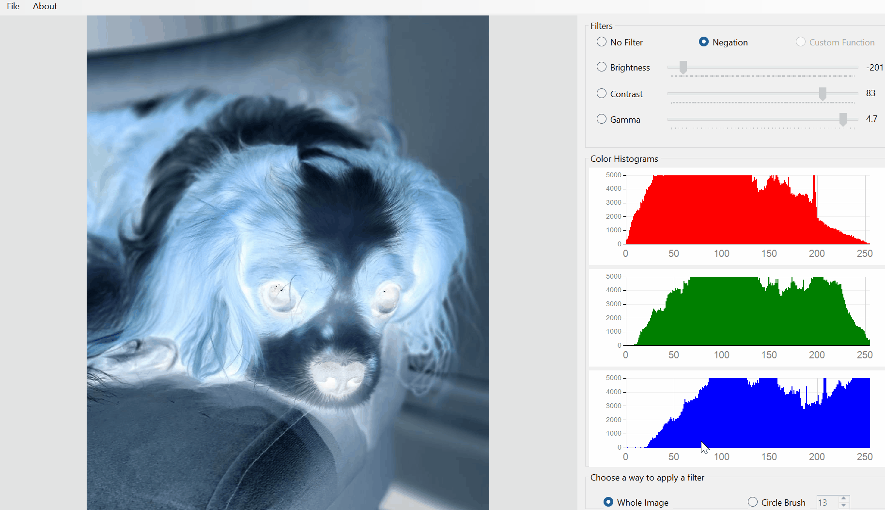

# Function Image Filter 

**Function Image Filter** is a very simple WinForms and C# application designed to apply different filters to images. 

I created this application as a 3rd part of my Computer Graphics course at Warsaw University of Technology (WUT) during thr 5th semester of Computer Science bachelor studies (2025/2026 academic year).

## Main idea

The main idea of this project is to allow user to load image and apply various filters to it. There are 4 filters implementes in this application:
- *Negation Filter* - inverts the colors of the image
- *Brightness Filter* - increases/decreases the brightness of the image
- *Gamma Filter* - applies gamma correction to the image
- *Contrast Filter* - increases/decreases the contrast of the image

Users can adjust the parameters of each filter using sliders and see the results in real-time. The application also allows users to save the modified image to their computer. 

There are 2 different modes of applying filters:
- *Whole Image* - applies the selected filter to the entire image
- *Selected Area* - applies the selected filter only to a specific area of the image, which can be selected by the user using mouse. The radius of the selected area can be adjusted using a numeric up-down. 

## Example of usage

## Technical Features

1. **Image loading and saving**. The application allows users to load images from their computer and save the modified images back to their computer. Supported image formats include JPEG, PNG, BMP.
2. **Real-time filter application**. Users can see the results of applying filters in real-time as they adjust the parameters using sliders.
3. **Many filters**. The application includes a variety of filters that can be possibly combined by user. 

## Future improvements

- The main window is kinda fixed-sized, as well as all controls. It would be nice to make the application more responsive and adaptable to different screen sizes and resolutions.
- The application currently supports only 4 filters. It would be great to add more filters, such as Custom Function Filter, allowing users to create their own custom filters by defining their own functions. 

## Interactive features

| 1. Image loading | 2. Applying filters to the whole image |
| :--: | :--: |
|  |  |
| 3. Applying filters to the selected area | 4. Saving the modified image |
|  |  |

## Requierements and setup

The application is built using .NET Framework and WinForms, so it requires .NET Framework to be installed on the user's computer. The application can be run on Windows operating system. To set up the application, follow the steps:
1. Clone the repository to your local machine.
2. Open the solution file in Visual Studio.
3. Build the solution to restore the necessary packages and dependencies.
4. Run the application

## Academic context
This project was developed for the *Computer Graphics* course at Warsaw University of Technology (WUT) during the 5th semester of Computer Science bachelor studies (2025/2026 academic year). 
+ *Faculty*: Faculty of Mathematics and Information Science
+ *Supervisor*: Dr. inż. **Paweł Kotowski**
+ *Grade received*: 10/15 (67%)

## Contact
If you have any questions or suggestions regarding the application, feel free to contact me:
+ **Github**: [@uasuna2022] (https://github.com/uasuna2022)
+ **Email**: [max.gomanchuk@gmail.com] (mailto:max.gomanchuk@gmail.com)
+ **Instagram**: [@m_a_k_s_i_m_g] (https://www.instagram.com/m_a_k_s_i_m_g/)
